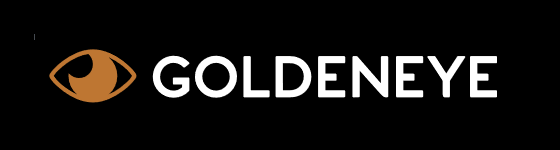

# GoldenEye

What is GoldenEye?
--------------------------------
**GoldenEye** is a Full Stack framework written in **.NET Core**. The main goal of **GoldenEye** is to speed up your development process. It gathers most widely used frameworks in .NET world and pack them into a simple bootstrap [Nuget packages](https://www.nuget.org/packages?q=GoldenEye). It also provide set of base classes, helpers, extensions that will help you with your daily work.

What do I get?
--------------------------------
Complete Solution bootstrap - bottom up:
- [Entity Framework](https://github.com/aspnet/EntityFrameworkCore) (supports also [Dapper](https://github.com/StackExchange/Dapper), [Marten](https://github.com/JasperFx/marten))
- [CRUD Repositories](https://github.com/oskardudycz/GoldenEye/tree/master/src/Core/Backend.Core/Repositories) and CRUD Application Services
- WebApi REST controllers
- Authorization with OAuth ([Identity Server](https://github.com/IdentityServer/IdentityServer4))
- complete set up of dependency injection with automatic naming convention binding
- [AutoMapper](https://github.com/AutoMapper/AutoMapper) preconfigured and automatic mappings registration
- Validation flow with [FluentValidation.NET](https://github.com/JeremySkinner/FluentValidation)
- Examples of complete usage (Task list functionality)
- CQRS and Domain Driven Development stack - sending and handling commands, queries, events (with usage of [MediatR](https://github.com/jbogard/MediatR) library)
- document database and event store support in Postgres with [Marten](https://github.com/JasperFx/marten) framework
- many more

How do I get started?
--------------------------------

**Install the [project template](https://github.com/oskardudycz/GoldenEye/tree/master/src/Templates/SimpleDDD/content) by running**

`dotnet new -i GoldenEye.WebApi.Template.SimpleDDD`

**and then create new project based on it:**

`dotnet new SimpleDDD -n NameOfYourProject`

Or manually add packages to your project, eg:

* **[Shared](src/Core/Shared.Core/Readme.md)** - GoldenEye.Shared.Core 
  
  `dotnet add package GoldenEye.Shared.Core` 
  
* **[Backend](src/Core/Backend.Core/Readme.md)** - GoldenEye.Backend.Core 
  
  `dotnet add package GoldenEye.Backend.Core` 
  
* **[Entity Framework](src/Core/Backend.Core.EntityFramework/Readme.md)** - GoldenEye.Backend.Core.EntityFramework 
  
  `dotnet add package GoldenEye.Backend.Core.EntityFramework` 
  
* **[WebApi](src/Core/Backend.Core.WebApi/Readme.md)** - GoldenEye.Backend.Core.WebApi 
  
  `dotnet add package GoldenEye.Backend.WebApi`
  

Where can I get it?
--------------------------------
Install packages from the Nuget package manager:

**Core packages**:
* [GoldenEye.Shared.Core](src/Core/Shared.Core/Readme.md) - base classes, helpers, extensions that will boost your development
* [GoldenEye.Shared.Core.Validation](src/Core/Shared.Core.Validation/Readme.md) - validation based on FluentValidation.NET
* [GoldenEye.Backend.Core](src/Core/Backend.Core/Readme.md) - classes suited for the backend development - Repositories, Services, CRUD, mappings, etc.
* [GoldenEye.Backend.Core.WebApi](src/Core/Backend.Core.WebApi/Readme.md) - base classes for API development like CRUD controllers, registration helpers, and many more
* [GoldenEye.Backend.Core.EntityFramework](src/Core/Backend.Core.EntityFramework/Readme.md) - extensions to GoldenEye.Backend.Core for EntityFramework development (EF repositories, etc.)
* [GoldenEye.Backend.Core.Dapper](src/Core/Backend.Core.Dapper/Readme.md) - extensions to GoldenEye.Backend.Core for Dapper development (Dapper repositories, etc.)

**Domain Driven Design package**:
* [GoldenEye.Backend.Core.DDD](src/Core/Backend.Core.DDD/Readme.md) - full DDD flow for CQRS, DDD development. Basing on [MediatR](https://github.com/jbogard/MediatR) library gives the Command, Queries, Events handling, routing

**Document database and Event Store with Marten package**:
* [GoldenEye.Backend.Core.Marten](src/Core/Backend.Core.Marten/Readme.md) - extension to GoldenEye.Backend.Core and GoldenEye.Backend.DDD that gives possibility to use Postgres as Document Database and Event Store - thanks to Marten library

**Security related packages (User management, OAuth etc.)**
* [GoldenEye.Shared.Security](src/Security/Shared.Security/Readme.md) - base classes to make security management easier
* [GoldenEye.Backend.Identity](src/Security/Backend.Identity/Readme.md) - helpers and extensions for Backend OAuth management with IdentityServer
* [GoldenEye.Frontend.Identity](src/Security/Frontend.Identity/Readme.md) - helpers and extensions for Frontend OAuth management with IdentityServer

I found an issue or I have a change request
--------------------------------
Feel free to create an issue on GitHub. Contributions, pull requests are more than welcome!

**GoldenEye** is Copyright &copy; 2015-2018 [Oskar Dudycz](http://oskar-dudycz.pl) and other contributors under the [MIT license](LICENSE.txt).
